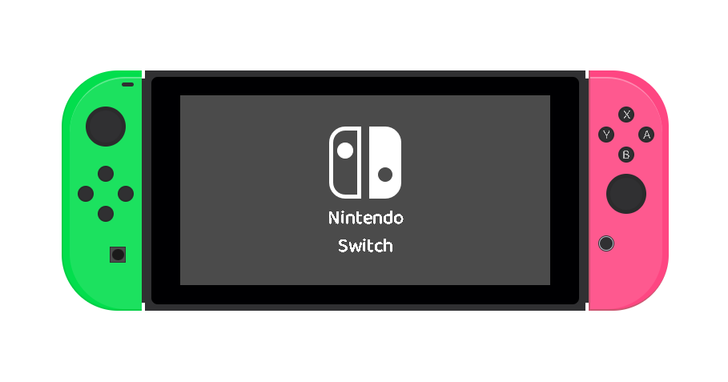

<h1>Console Nintendo Switch</h1>

<H2>Descrição do projeto:</H2>

     Foi realizado uma representação gráfica do console da Nintendo Switch.
     Objetivo foi trabalhar com algumas animações e estilização desde os joysticks, tela, botoes, logo interno, nome/marca e alguns detalhes do console também foi estilizado no Css,a estilização foi limitados apenas ao uso do CSS,
     E sua  estrutura é feito em HTML5.

<B>Observação:</B>
o projeto é feito 100% em HTML e CSS.

<h2>Tecnologias</h2>
<table>
<tr>
<td>

</td>
<td>VISUAL STUDIO CODE<td>
</tr>
<tr>
<td>

</td>
<td>HTML 5<td>
</tr>
<tr>
<td>

</td>
<td>JAVA SCRIPT<td>
</tr>
<tr>
<td>

</td>
<td>Css<td>
</tr>

</table>